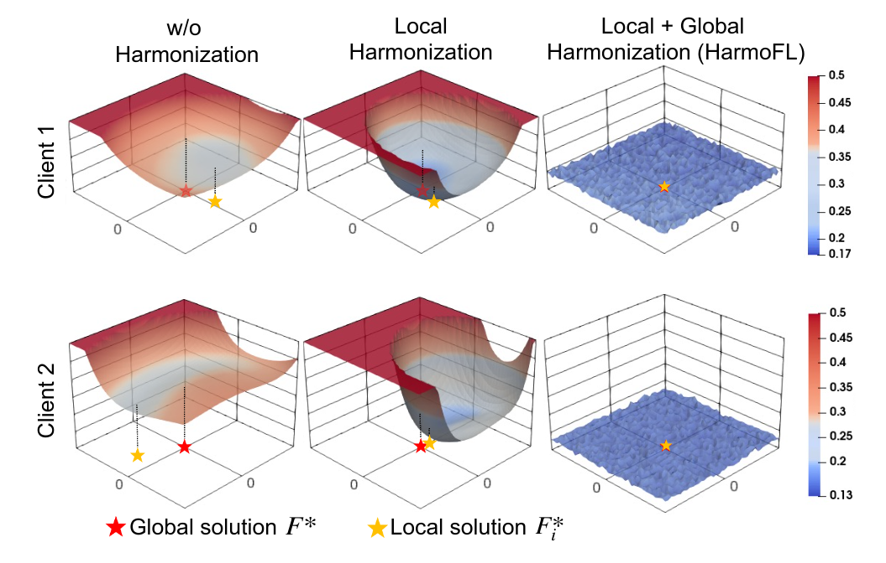

# HarmoFL: Harmonizing Local and Global Drifts in Federated Learning on Heterogeneous Medical Images
This is the PyTorch implemention of our paper **HarmoFL: Harmonizing Local and Global Drifts in Federated Learning on Heterogeneous Medical Images** by [Meirui Jiang](https://meiruijiang.github.io/MeiruiJiang/), Zirui Wang and [Qi Dou](http://www.cse.cuhk.edu.hk/~qdou/).

## Abstract
> Multiple medical institutions collaboratively training a model using federated learning (FL) has become a promising solution for maximizing the potential of data-driven models, yet the non-independent and identically distributed (non-iid) data in medical images is still an outstanding challenge in real-world practice. The feature heterogeneity caused by diverse scanners or sensors introduces a drift in the learning process, in both local (client) and global (server) optimizations, which harms the convergence as well as model performance. Many previous works have attempted to address the non-iid issue by tackling the drift locally or globally, but how to jointly solve the two essentially coupled drifts is still unclear. In this work, we concentrate on handling both local and global drifts and introduce a new harmonizing framework called HarmoFL. First, we propose to mitigate the local update drift by normalizing amplitudes of images transformed into the frequency domain to mimic a unified scanner/sensor, in order to generate a harmonized feature space across local clients. Second, based on harmonized features, we design a client weight perturbation guiding each local model to reach a flat optimum, where a neighborhood area of the local optimal solution has a uniformly low loss. Without any extra communication cost, the perturbation assists the global model to optimize towards a converged optimal solution by aggregating several local flat optima. We have theoretically analyzed the proposed method and empirically conducted extensive experiments on three medical image classification and segmentation tasks, showing that HarmoFL outperforms a set of recent state-of-the-art methods with promising convergence behavior.



## Usage
### Setup
**Conda**

We recommend using conda to setup the environment, See the `requirements.yaml` for environment configuration 

If there is no conda installed on your PC, please find the installers from https://www.anaconda.com/products/individual

If you have already installed conda, please use the following commands.

```bash
conda env create -f environment.yaml
conda activate harmofl
```

**Build cython file**

build cython file for amplitude normalization
```bash
python utils/setup.py build_ext --inplace
```

### Dataset & Trained Model
#### Histology Breast Cancer Classification
- Please download the histology breast cancer classification datasets [here](https://worksheets.codalab.org/rest/bundles/0xe45e15f39fb54e9d9e919556af67aabe/contents/blob/), extract and put folder 'patches' under `data/camelyon17` directory:

#### Prostate MRI Segmentation
- Please download the prostate MRI datasets [here](https://liuquande.github.io/SAML/), put the folder `data` under `data/prostate` directory.

#### Histology Nuclei Segmentation
- Please download the histology nuclei segmentation datasets [here](https://meiruijiang.github.io/MeiruiJiang/NucSeg/), and put under `data/nuclei` directory.

#### Trained Models
- Please download our trained model [here](https://drive.google.com/file/d/1ivv5Aj8LiAj4DlFC31zlGCuGxQwJBYNN/view?usp=sharing). 


### Train
`fed_train.py` is the main file to run the federated experiments
Please using following commands to train a model with federated learning strategy.
```bash
# HarmoFL experiment on three tasks
bash train.sh
```
Below please find some useful options:
- **--alpha** :specify the degree of weight perturbation, default is 0.05.
- **--wk_iters** :specify the local update epochs, default is 1.
### Test
suppose your test model's path is 'model/data/harmofl'
```bash
# HarmoFL test on three tasks
bash test.sh
```